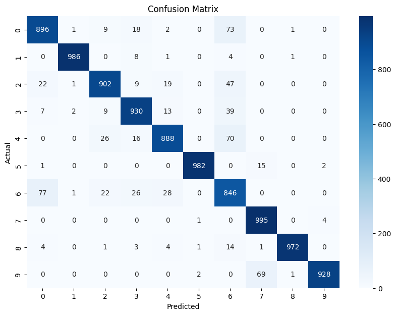

# 👟 FashionMNIST Classification with MobileNet (Transfer Learning)

This project uses **transfer learning** with **MobileNetV2** to classify the **FashionMNIST** dataset, a benchmark dataset of grayscale images representing clothing items. We adapt the grayscale 28×28 images to RGB 224×224 for compatibility with MobileNet.

---

## 📚 Dataset

FashionMNIST includes 10 categories:
- T-shirt/top
- Trouser
- Pullover
- Dress
- Coat
- Sandal
- Shirt
- Sneaker
- Bag
- Ankle boot

Each image is originally grayscale (1 channel), 28×28 pixels.

---

## 🧠 Model Overview

We use `MobileNetV2` (pretrained on ImageNet) as a frozen feature extractor and add a custom classifier on top:

- **Input Processing**:  
  - Resize to 224×224  
  - Convert grayscale to RGB using:  
    ```python
    transforms.Lambda(lambda x: x.repeat(3, 1, 1))
    ```
- **Model Architecture**:
  - MobileNetV2 base (frozen)
  - Global Average Pooling
  - Dense → ReLU → Dropout → Final Softmax layer (10 classes)

---

## 🛠️ Training Pipeline

1. **Preprocess Dataset** using PyTorch `transforms`
2. **Custom Dataset Loader** wraps the HuggingFace FashionMNIST dataset
3. **Model Training** with cross-entropy loss and Adam optimizer
4. **Evaluation** using accuracy, precision, recall, F1, and confusion matrix
5. **Visualization** of predictions and confusion matrix

---

## 🔍 Sample Predictions

Below are some predictions made by the model:


---

## 📊 Confusion Matrix

Model performance across all 10 classes:



---

## 💻 Requirements

```bash
pip install torch torchvision transformers datasets matplotlib scikit-learn
```

## ✅ To-Do
Unfreeze and fine-tune some MobileNet layers

Add data augmentation to reduce overfitting

Try different pre-trained models (EfficientNet, ResNet)
